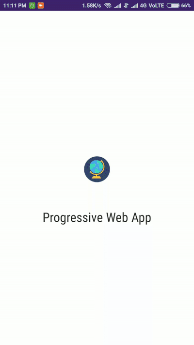

# Progressive Web App in Angular 5

Create a **manifest.json** file and add it under the assets section in **.angular-cli.json**.

Create a service worker _ngsw-config.json_ which are required to enable the creation of effective offline experiences.

Add a line under the **apps** section in **.angular-cli.json** :

`"serviceWorker": true`

You can manually create the files or use this command :

`ng new projectName --service-worker`

This will enable, install, generate and register the service worker for our application.

